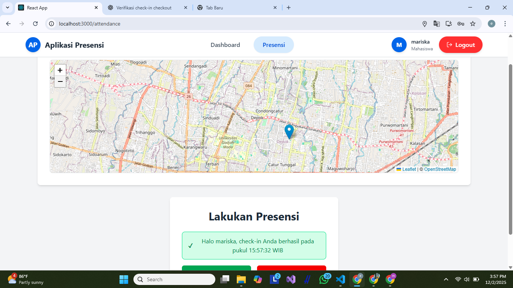
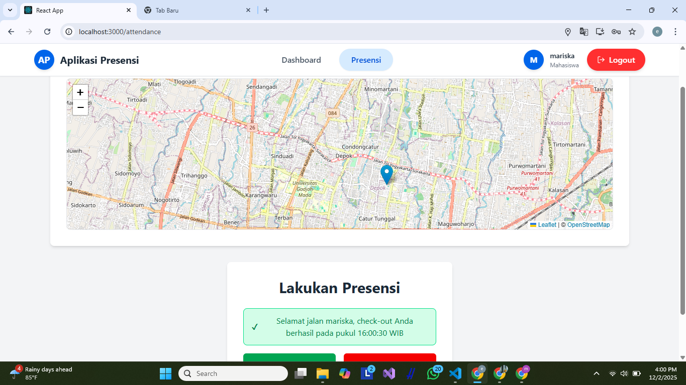

Tampilan endpoint 

Tampilan Database

Tampilan halaman presensi Check-in berhasil dengan menampilkan maps OSM (Admin)

Tampilan halaman presensi Check-out berhasil dengan menampilkan maps OSM (Admin)

Tampilan halaman report yg berisi data presensi dari semua user

Tampilan halaman presensi Check-in berhasil dengan menampilkan maps OSM (Mahasiswa)

Tampilan halaman presensi Check-out berhasil dengan menampilkan maps OSM (Mahasiswa)
